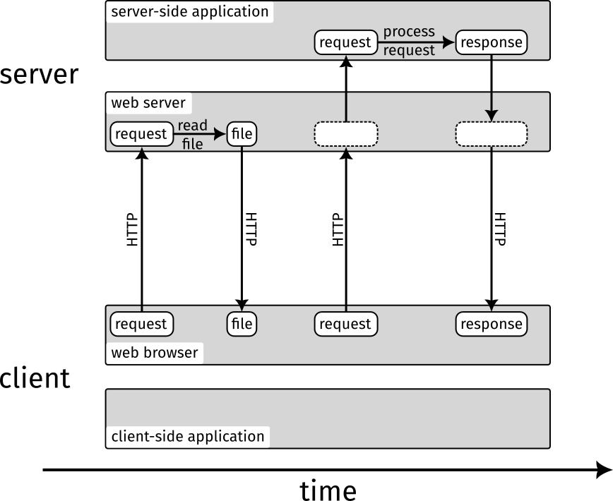

# Lesson 0: Web Application Fundamentals

We call the basic entities of a web application the *client* and the *server*. Client and server communicate using the hypertext transfer protocol (HTTP). The client is most often a web browser but could also be a command line tool or other applications. The server is typically a remote and publicly accessible computer that runs a *web server* (such as [Nginx](https://www.nginx.com) or [Apache](https://httpd.apache.org)) as well as a *server-side application* (written in a language such as [PHP](https://www.php.net), [Python](https://www.python.org) or [Java](https://www.java.com)). Often, web applications also include a *client-side application* that is written in [JavaScript](https://developer.mozilla.org/en-US/docs/Web/JavaScript) and runs in the web browser.

In a normal interaction between client and server, the client sends an HTTP request to the server (e.g. by opening a URL in the browser). The web server receives the HTTP request and either simply returns a requested file (such as an image) or passes the request on to the server-side application. The server-side application can process the request and perform arbitrary actions (e.g. communicate with a database, create or modify files). Finally, the server-side application returns a response to the web server, which in turn sends the HTTP response to the client. It can get a little more complicated if a client-side application is involved but we will get to that later.

This typical interaction between client and server is illustrated below:

Over the next three lessons you will learn to set up a web server to respond with static files, then implement a simple server-side application in PHP and finally take a look at client-side applications with JavaScript.

**Next lesson:** [Static Files](/lesson-1)
