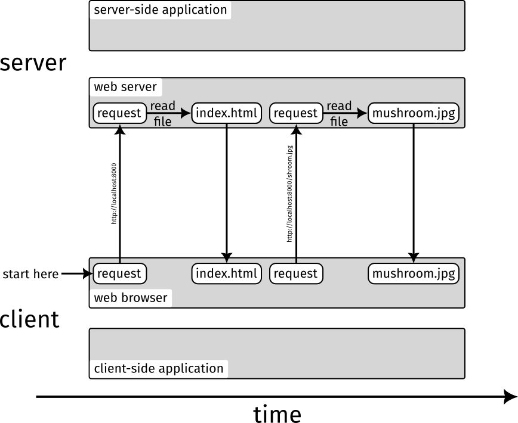

# Lesson 1: Static Files

The most basic "web application" is one that serves static files through a web server. This is how many websites work, as they do not need any dynamic components. The most popular web servers are [Nginx](https://www.nginx.com) and [Apache](https://httpd.apache.org). These are quie complex to set up, however, and we do not want to clutter your system with software that continuously runs in the background. Fortunately, PHP includes its own little web server which works just fine for local development. In this lesson, you will use the PHP web server to serve some static files and display them in your web browser.

First, create an empty directory. This is the place where all the work will happen throughout the following lessons:

```bash
mkdir webdev
cd webdev
```

Next, copy a nice image into this directory. If you do not have one yourself, take [this one](shroom.jpg).

Now we can start the web server:

```bash
php -S localhost:8000
```

The web server helpfully tells you that it now listens to `http://localhost:8000` which looks quite like an URL that can be opened in a browser. Instead of a domain such as `github.com`, the URL contains `localhost` which points to your own machine. Also, the URL contains `:8000` which specifies the port at which the web server is listening to incoming requests. By default, web servers listen at port 80 (for `http` URLs) and port 443 (for `https` URLs), so the port specification can be omitted and the web browser knows what to do. But it is not so easy to make a development web server listen to these ports (you can try), hence we use the non-default port 8000.

To make the web server respond with the image we put into our working directory, open <http://localhost:8000/shroom.jpg> (change the file name in the URL if you have used a different image). Your web browser will send an HTTP request for the image to the web server, which in turn will respond with the file that is finally displayed by the browser. The web server will also tell you what is is doing by printing log messages to the console:

```
[Thu Jul 14 15:26:25 2022] 127.0.0.1:55760 Accepted
[Thu Jul 14 15:26:25 2022] 127.0.0.1:55760 [200]: GET /shroom.jpg
[Thu Jul 14 15:26:25 2022] 127.0.0.1:55760 Closing
```

Here the web server received an HTTP request, returned the image file and closed the HTTP connection again.

To finish this lesson, we also want to display some text in the web browser, just like a real website. For this purpose, web browsers understand the Hypertext Markup Language (HTML). HTML structures and enriches information such as text and images in a machine-readable way.

Create a new HTML file called `index.html` with the following content:

```html
<h1>Hello there!</h1>
```

Now open <http://localhost:8000>. Note that we didn't have to specify the file name in the URL this time. The web server automatically looks for an `index.html` file if no other file name is given.

We can even include our image in the HTML document:

```html
<h1>Hello there!</h1>

```

This time the web browser will automatically send a second HTTP request to fetch the image and display it in the HTML document. The client-server communication now looks like this:




**Next lesson:** [Lesson 2: Server-Side Application with PHP](/lesson-2)
