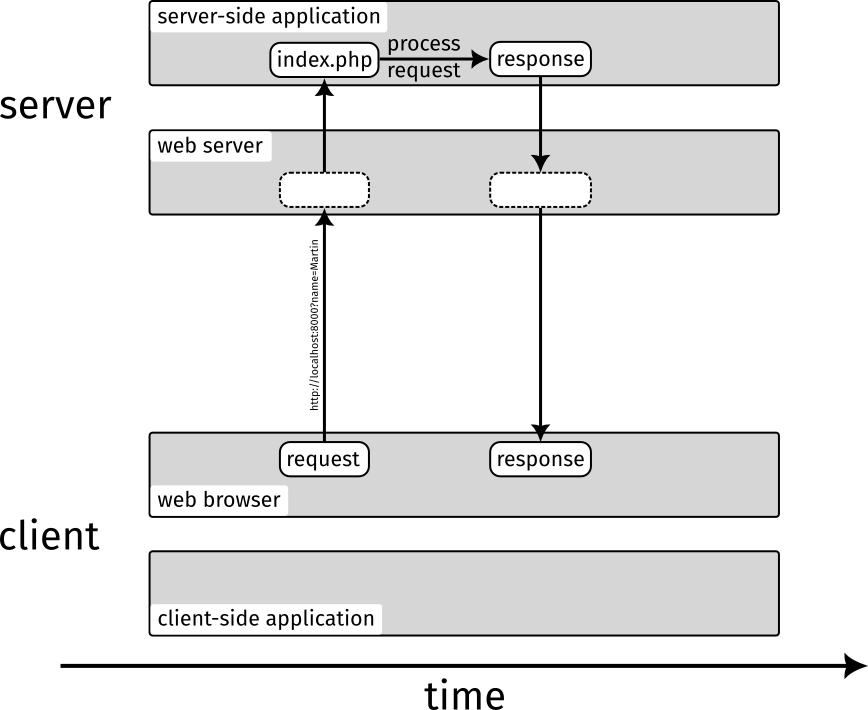

# Lesson 2: Server-Side Application with PHP

Writing a simple web application that can produce dynamic responses is ridiculously easy with PHP. We only need a web server that can run PHP code ([check](/lesson-1)) and a PHP file. To get the PHP file, simply rename the `index.html` file of the previous lesson the `index.php`. To keep it simple, we remove the image tag again, so the file looks like this:

```html+php
<h1>Hello there!</h1>
```

You can now start the web server again and open <http://localhost:8000>. As we use the PHP development server, it will look for an `index.php` file if no other file is specified (it will even prefer `index.php` to `index.html`).

Now we can add some PHP code to generate the HTML document dynamically:

```html+php
<h1>Hello <?php echo htmlspecialchars($_GET['name'] ?? 'there') ?>!</h1>
```

For now, the content should look exactly as before if you open the document in your web browser. Let's break down what the change does:

The `<?php ... ?>` part means that here comes some PHP code. In our case, this is interpreted and executed directly by the PHP development server. In a "production" scenario, this would be handled by a web server module or [PHP-FPM](https://www.php.net/manual/en/install.fpm.php).

`echo` will print everything that follows as a sting. Here, this string will be included in the HTML document.

`$_GET['name']` returns the information from the "query string" of the URL. This is an optional part at the end of an URL that starts with a `?`. It can look like this: `?key1=value1&key2=value2`. In our case, we want the value of the `name` key.

`?? 'there'` tells PHP to use the string "there" as a fallback in case there is no `name` key in the query string of the URL and `$_GET['name']` does not exist. This is why the HTML document still looks the same since we did not specify a query string, yet.

`htmlspecialchars` escapes special HTML characters so people cannot construct a malicious query string (e.g. one that loads an invisible tracking script). This is a security best practice but we don't need to care about this any more once we start using Laravel as a full web application framework.

Now open <http://localhost:8000?name=gorgeous> and see your web application in action!

The client-server communication now looks like this:


