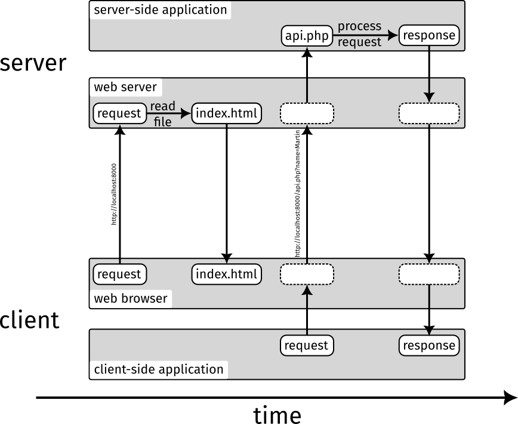

# Lesson 3: A Client-Side Application with JavaScript

Client-side applications written in JavaScript can make web applications do interactive and dynamic things that do not require a reload of the current page or opening of a new URL. The client-side application is executed in the web browser of the client. There, it runs "in the background" of the web page and can change the content of the displayed HTML document dynamically. Often, client-side applications communicate with their server-side counterpart through an HTTP application programming interface (API). In this lesson, we will implement a basic client-side application that uses a simple server-side API.

Let us start with a basic `index.html` file:

```html
<h1>Hello there!</h1>
```

In this lesson we want to replace "there" dynamically *after* the HTML document was loaded and displayed. First, we will do this directly on the client. Later, we introduce an extra call to the server-side API.

Before we can replace "there" with something else using JavaScript, we need something to identify the location in the HTML document where JavaScript should make the change:

```html
<h1>Hello <span id="name">there</span>!</h1>
```

The `span` is an invisible element that wraps the HTML content that we want to modify. The element has an ID that can be used to identify it.

Next, we need to add a method to enter the new name that we want to put in the `span` element. We can use an HTML form for this:

```html
<h1>Hello <span id="name">there</span>!</h1>
<form id="form">
   <input type="text" name="name">
   <button type="submit">Submit</button>
</form>
```

Take a look at the document in your browser and you will see an input element and a "submit" button appear. Note that we also assign an ID to the `form` element because we also need to identify it with JavaScript.

Now we can finally add some JavaScript code. Usually, the code for the client-side application is separated from the HTML document in an extra `.js` file. But JavaScript can also be included "inline" in the HTML document, which is simpler here:

```html
<h1>Hello <span id="name">there</span>!</h1>
<form id="form">
   <input type="text" name="name">
   <button type="submit">Submit</button>
</form>
<script type="text/javascript">
   let span = document.getElementById('name');
   let form = document.getElementById('form');
   form.addEventListener('submit', function (event) {
      event.preventDefault();
      span.innerText = form.elements['name'].value;
   });
</script>
```

Let's break this down:

- `document.getElementById('name')` retrieves the HTML element with the ID "name" from the current HTML document. We do the same for the form element.

- `form.addEventListener('submit', ...)` registers a new function that is executed whenever the form should be submitted (e.g. the "submit" button is pressed).

- `event.preventDefault()` must be called to prevent the default action of the form, which would send a new HTTP request with the form content as query parameters. This would work completely without JavaScript. You could try to use the form with the default behavior in [lesson 2](/lesson-2) (it works).

- `span.innerText = form.elements['name'].value` retrieves the value of the form element with `name="name"` and sets the text content of the `span` element to this value.

There you have your client-side application! Give it a try.

Now we introduce an API call to the server-side application. First, create a new file called `api.php`:

```php
<?php

$response = [
   'name' => htmlspecialchars($_GET['name'] ?? 'there'),
];

echo json_encode($response);
```

This file looks a little different than the PHP file of [lesson 2](/lesson-2). It doesn't contain any HTML and has no `?>` closing tag. PHP-only files like these are what you will typically see in a PHP application. Here we create a new `$response` array that contains the name from the query parameters (or the fallback). The script passes the array through `json_encode` which will produce a [JSON](https://developer.mozilla.org/en-US/docs/Learn/JavaScript/Objects/JSON) string that is returned as output by `echo`. JSON is a widely used file format that both PHP and JavaScript support.

We can now test the API script by opening <http://localhost:8000/api.php?name=buddy>.

Next, we update the JavaScript code to perform an HTTP request to the API "in the background" without reloading the page:

```html
<h1>Hello <span id="name">there</span>!</h1>
<form id="form">
   <input type="text" name="name">
   <button type="submit">Submit</button>
</form>
<script type="text/javascript">
   let span = document.getElementById('name');
   let form = document.getElementById('form');
   form.addEventListener('submit', function (event) {
      event.preventDefault();
      let query = new URLSearchParams({name: form.elements['name'].value});
      fetch(`api.php?${query}`)
         .then(response => response.json())
         .then(data => span.innerText = data.name);
   });
</script>
```

This might look a little complicated but it's doing cool things!

- `new URLSearchParams(...)` is a helper to build a query string of an URL. Here we instruct it to add a `name` key with the value of the HTML input element to the query string.

- ``fetch(`api.php?${query}`)`` sends a new HTTP request to the API script. We use the JavaScript [template literal](https://developer.mozilla.org/en-US/docs/Web/JavaScript/Reference/Template_literals) syntax to easily append the query string to the target URL of the request. The call to `fetch()` returns a [promise](https://developer.mozilla.org/en-US/docs/Web/JavaScript/Guide/Using_promises) which is an interesting aspect of the "asynchronous" nature of JavaScript programming (see below).

- `.then(response => response.json())` executes the `then()` method of the promise returned by `fetch()`. The argument is an [arrow function](https://developer.mozilla.org/en-US/docs/Web/JavaScript/Reference/Functions/Arrow_functions) that is executed when the HTTP response was received. This is what "asynchronous" means with JavaScript: The program flow arrives at this line but the code will be executed at some later time (when the response arrives). Here, the function will parse and return the JSON content of the response.

- `.then(data => span.innerText = data.name)` will be executed after the previous `then()` and receives the returned JSON data from it. This function will set the content of the `span` element based on the content of the JSON data.

Go on and try it. On the surface, the page will behave exactly as before but underneath it works like an actual web application consisting of a client-side and a server-side part!

**ProTip**: You can open the web browser developer tools with <kbd>F12</kbd> and select the "Network" tab to see the HTTP requests being sent in real time.

The client-server communication now looks like this:



These were the basics of "vanilla" web application development with PHP and JavaScript without any application framework. Next, we'll have a short interlude about CSS to make web applications pretty and usable.

**Next lesson:** [CSS (interlude)](/lesson-4)
